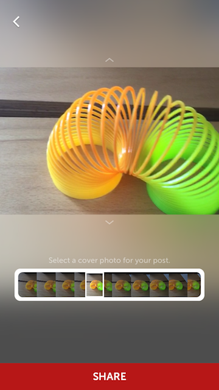
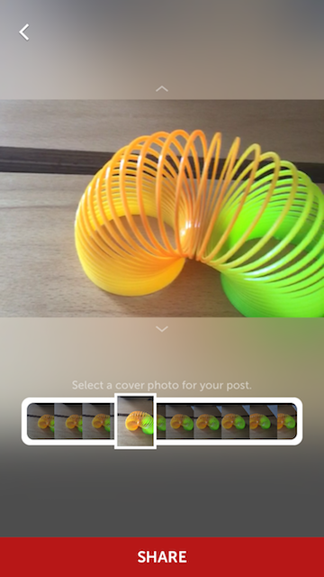

# VideoThumbnailSelectionView
Video thumbnail (cover) selection tool similar to the one in Instagram's app. Written in Swift 2.2.




## Installation
### CocoaPods
To add VideoThumbnailSelectionView to your project, you can specify it in your `Podfile`:
```ruby
source 'https://github.com/CocoaPods/Specs.git'
platform :ios, '8.0'
use_frameworks!

pod 'VideoThumbnailSelectionView', '~>0.1.1'
```

## Usage
### Initialization
#### Storyboard
You can add a UIView to your Storyboard and set both the **Class** and the **Module** properties to **VideoThumbnailSelectionView**.


After that link with the relevant IBOutlet.

**Swift**
```swift
@IBOUtlet weak var videoThumbnailSelectionView: VideoThumbnailSelectionView!
```

**Obj-c**
```obj-c
@property (weak, nonatomic) IBOutlet VideoThumbnailSelectionView *videoThumbnailSelectionView;
```

#### Code
You can also init the view from code.

**Swift**
```swift
import VideoThumbnailSelectionView
.
.
var videoThumbnailSelectionView: VideoThumbnailSelectionView!
.
.
.
videoThumbnailSelectionView = VideoThumbnailSelectionView(frame:CGRectMake(20.0, 20.0, 325.0, 60.0))
view.addSubview(selectionView)
```

**Obj-c**
```obj-c
@import VideoThumbnailSelectionView;
.
.
@property (strong, nonatomic) VideoThumbnailSelectionView * videoThumbnailSelectionView;
.
.
.
_videoThumbnailSelectionView = [[VideoThumbnailSelectionView alloc] initWithFrame:CGRectMake(20.0, 20.0, 325.0, 60.0)];
[self.view addSubview:selectionView];
```

### Customization

**Swift**
```swift
//Alpha of the black tint on the thumbnails behind the thumb
videoThumbnailSelectionView.shadeTintAlpha = 0.5
//scale animation when thumb is dragged (1.0 for no animation).
videoThumbnailSelectionView.zoomAnimationScale = 1.5
//corner color
videoThumbnailSelectionView.cornerColor = .whiteColor()
//corner radius
videoThumbnailSelectionView.cornerRadius = 8.0
//corner thickness
videoThumbnailSelectionView.cornerInsets = UIEdgeInsetsMake(6.0, 6.0, 6.0, 6.0)
//called when selection changes
videoThumbnailSelectionView.onUpdatedImage = { image in
  //do stuff with the image
};
```

**Obj-c**
```obj-c
//Alpha of the black tint on the thumbnails behind the thumb
_videoThumbnailSelectionView.shadeTintAlpha = 0.5;
//scale animation when thumb is dragged (1.0 for no animation).
_videoThumbnailSelectionView.zoomAnimationScale = 1.5;
//corner color
_videoThumbnailSelectionView.cornerColor = [UIColor whiteColor];
//corner radius
_videoThumbnailSelectionView.cornerRadius = 8.0;
//corner thickness
_videoThumbnailSelectionView.cornerInsets = UIEdgeInsetsMake(6.0, 6.0, 6.0, 6.0);
//called when selection changes
_videoThumbnailSelectionView.onUpdatedImage = ^(UIImage *image){
  //do stuff with the image
};
```

### Loading

**Swift**
```swift
override func viewWillAppear(animated: Bool) {
  super.viewWillAppear(animated)
  //after customization, call this to load your asset.
  thumbnailSelectionView.loadVideo(asset)
}
```

**Obj-c**
```obj-c
- (void)viewWillAppear:(BOOL)animated {
    [super viewWillAppear:animated];
    //after customization, call this to load your asset.
    [_videoThumbnailSelectionView loadVideo:asset];
}
```

### Deleting

If you need to load a new video you must do this before calling load again.

**Swift**
```swift
thumbnailSelectionView.deleteVideo()
```

**Obj-c**
```
[_videoThumbnailSelectionView deleteVideo];
```

##Notes
Make sure you have 'define modules' enabled in build settings.

## Licence
VideoThumbnailSelectionView is available under the MIT license.

## Author
Sarp Solakoglu - sosolakoglu@gmail.com

[@Follow me on Twitter](http://twitter.com/sarpsolakoglu)

